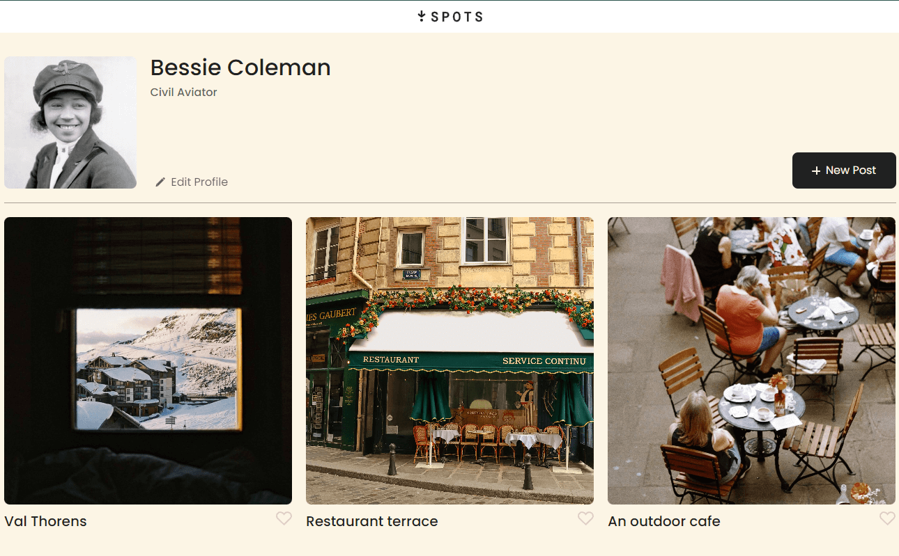

# Spots - Social Media Web Application

Live Demo: [Spots](https://nosracsixela.github.io/se_project_spots/)

Video description of project: 

This is the third project of the Software Engineering program at TripleTen. It was created using HTML and CSS, based on the design brief on Figma.

## Overview

Spots is a social media web application where users can upload and remove photos, like others' posts, and make small profile updates. Designed for seamless interaction, the platform encourages user engagement through a simple, photo-focused interface.

### Project features

- User Interactions: Add, remove, and like photos
- Profile Customization: Edit profile details
- Responsive Design: Optimized for various screen sizes
- Semantic HTML5: Ensures proper content structure
- BEM Methodology: Consistent and modular CSS
- CSS grid layout
- Flexbox
- Positioning

**Figma**

- [Link to the project on Figma](https://www.figma.com/file/BBNm2bC3lj8QQMHlnqRsga/Sprint-3-Project-%E2%80%94-Spots?type=design&node-id=2%3A60&mode=design&t=afgNFybdorZO6cQo-1)

#### Future Improvements

- Add user authentication
- Implement comment sections
- Expand profile settings
